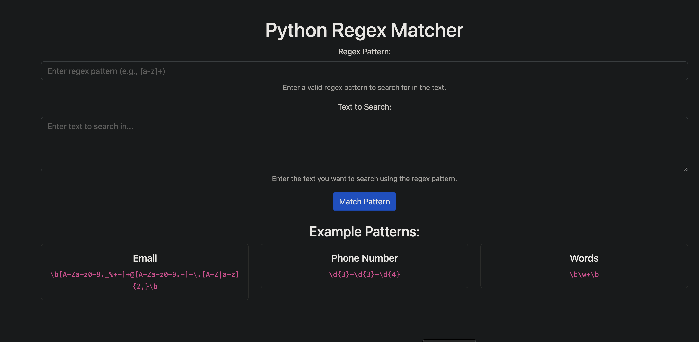

# Python-regex-website

This is example of demo web service using python for regex pattern matching.

## Screenshot


## Usage 

```bash
make
help                 💬 This help message
setup                 Performs env setup
lint                  Lint code with pylint
test                  Runs pytest
cov                   Runs tests coverage
build                 Builds docker container
run                   Run docker container locally
push                  Push container to dockerhub
docs                  Generate code documentation with pdoc
clean                 clean test files
```

## How to access app locally
http://127.0.0.1:5000/


